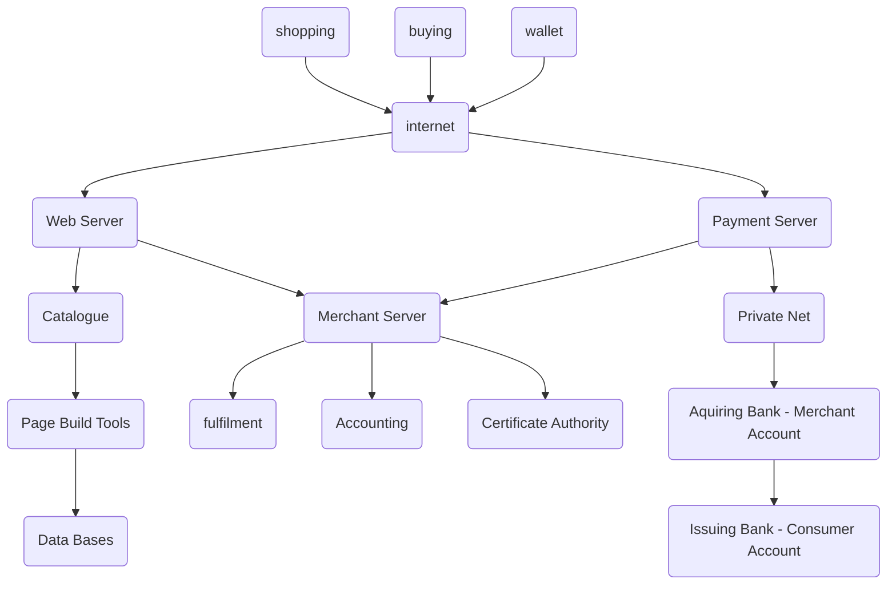

[[Chapter 6 - E-Commerce Software]]

```mermaid
graph TD
shopping(shopping)
buying(buying)
wallet(wallet)

internet(internet)

web(Web Server)
ms(Merchant Server)
fulfilment(fulfilment)
accounting(Accounting)
cert(Certificate Authority)

catalogue(Catalogue)
pbt(Page Build Tools)
db(Data Bases)

ps(Payment Server)
pn(Private Net)
ab(Aquiring Bank - Merchant Account)
ib(Issuing Bank - Consumer Account)


shopping & buying & wallet --> internet

internet --> web & ps

catalogue --> pbt --> db

ps --> ms & pn

pn --> ab --> ib

web --> catalogue & ms

ms --> fulfilment & accounting & cert

```
*Typical enterprise-class electronic communication architecture*