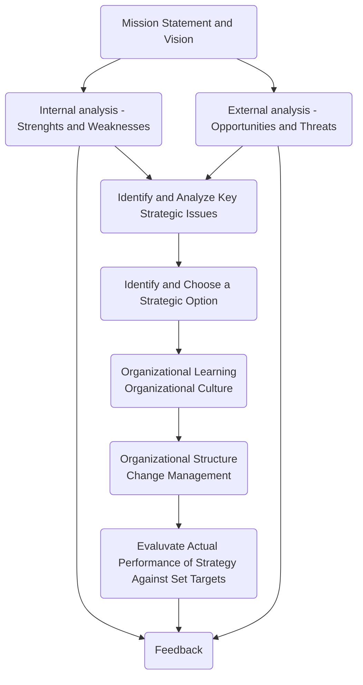

[[Chapter 8 - Critical Success Strategies]]

```mermaid
graph TD
statement(Mission Statement and Vision)
ina(Internal analysis - Strenghts and Weaknesses)
exa(External analysis - Opportunities and Threats)
id1(Identify and Analyze Key Strategic Issues)
id2(Identify and Choose a Strategic Option)
or1(Organizational Learning\nOrganizational Culture)
or2(Organizational Structure\nChange Management)
eval(Evaluvate Actual Performance of Strategy Against Set Targets)
feedback(Feedback)


statement --> ina & exa
ina --> feedback
ina & exa --> id1 --> id2 --> or1 --> or2 --> eval --> feedback
exa --> feedback
```
 ***Note: The arrowhead on the feedback are reversed***