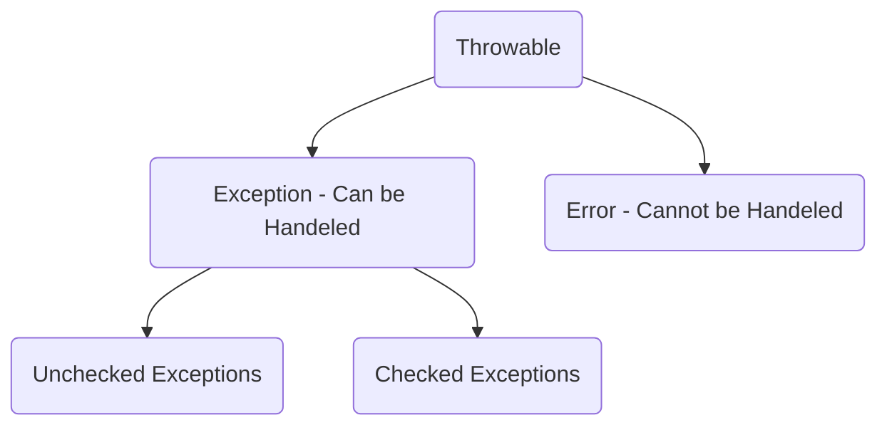

#java

All Exceptions come from class Throwable
There are 2 types of statements:
1. Normal Statements - `int i = 1;`
2. Critical statements - `int k = 1/j;`


```java
try {
	int i = j/k;
}
catch(ArithmaticException ae) {
	// some code
}
```
