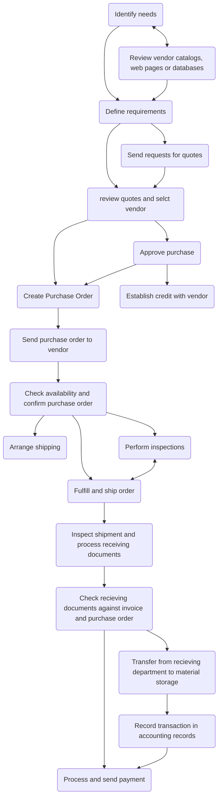

[[Chapter 4 - E Commerce strategies]]

- Purchasing activities include ***identifying and evaluating vendors, selecting specific products, placing orders, and resolving any issues that arise after receiving the ordered goods or services.***
- These issues might include *late deliveries, incorrect quantities, incorrect items, and defective items*
- By monitoring all relevant elements of purchase  transactions, purchasing managers can play an important role in maintaining and improving product quality and reducing cost
- A company’s supply chain includes **design, produce, promote, market, deliver, and support each individual component of that product or service**
- This Department is charged with buying all components at the lowest price possible
- They do this by **identifying** qualified vendors and asking them to prepare **bids** that described what they would supply and how much they would **charge**
- Then **select the lowest bid** that still **met the quality standards** for the component

There are two types of purchasing
1. Direct Materials Purchasing
2. Indirect Materials Purchasing

[[Direct vs. Indirect Materials Purchasing]]